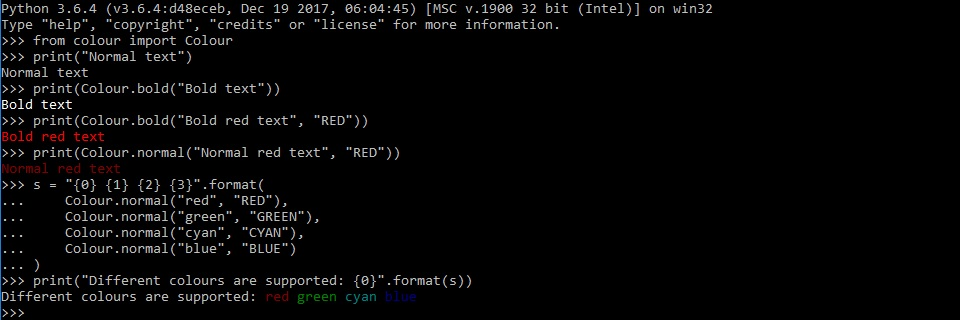

# colour
Write stuff in colour.

## Installation

### Source (with pip)
 - Clone this repository -- `$ git clone https://github.com/alexmacniven/colour.git`
 - Build the source -- `$ python setup.py sdist`
 - Install the package -- `$ pip install dist/colour-{version}.tar.gz`

### With Pipenv
 - Install from repo -- `$ pipenv install -e git+https://github.com/alexmacniven/colour.git#egg=colour`

## Usage

